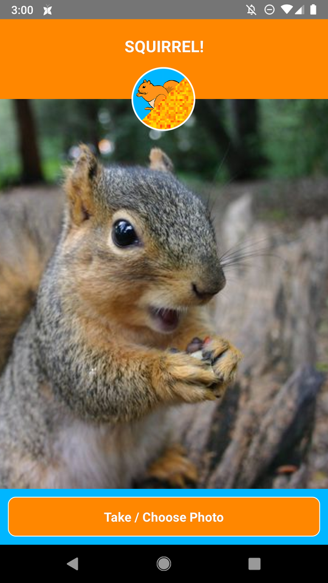
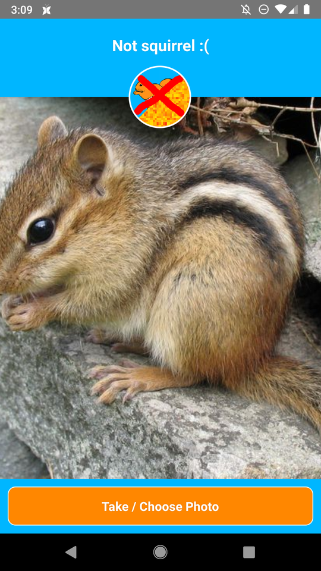

# notsquirrel
(WIP) A silly React Native + Tensorflow Lite Android app to tell you whether or not something is a squirrel.

Inspired by the incredibly aggressive squirrels that climb up the (heavily oiled!) bird feeder pole in my backyard. Inspiration and end-goal is something like [this](https://www.slideshare.net/kgrandis/pycon-2012-militarizing-your-backyard-computer-vision-and-the-squirrel-hordes) fantastic Arduino + Python squirrel super soaker sentry from PyCon 2012.

For now, just following in [Jinyang's](https://www.youtube.com/watch?v=vIci3C4JkL0) shoes. Is it a squirrel or not-squirrel?

Uses the following resources and libraries:

* `retrained_graph.pb` and `retrained_labels.txt` from a Tensorflow Lite graph retrained on images of squirrels and squirrel-like rodents, per the tutorial at [TensorFlow for Poets](https://codelabs.developers.google.com/codelabs/tensorflow-for-poets/#0)
* Modified fork of **react-native-tensorflow** ([Original](https://github.com/reneweb/react-native-tensorflow))([Fork](https://github.com/sometimescasey/react-native-tensorflow/tree/revision))
* Modified fork of **react-native-image-picker** ([Original](https://github.com/react-community/react-native-image-picker/))([Fork](https://github.com/sometimescasey/react-native-image-picker))
* [**react-native-fs**](https://github.com/itinance/react-native-fs)

# Install
## Android
**Direct download:** Install the latest .apk from [./release/android/notsquirrel.apk](./release/android/notsquirrel.apk)<br>
**App store:** TBD

## iOS
Coming as soon as I'm not too poor to get a iPhone to test on. :)

# Screenshots



# Build
All commands should be run on `master` from the project root folder unless otherwise specified.

1) Install npm packages. Note that this project's `package.json` points to the modified forks.
```
npm install
```

2) Specify Android SDK path: create/edit `android/local.properties` and set `sdk.dir` (or set the `ANDROID_HOME` env variable). Example:
```
## This file must *NOT* be checked into Version Control Systems,
# as it contains information specific to your local configuration.
#
# Location of the SDK. This is only used by Gradle.

sdk.dir=/home/casey/Android/Sdk
```

3) Run Bundler:
```
react-native bundle --platform android --dev false --entry-file index.js --bundle-output android/app/src/main/assets/index.android.bundle --assets-dest android/app/src/main/res/
```

4) Generate keystore and configure gradle variables (see https://facebook.github.io/react-native/docs/signed-apk-android.html). Then assemble:
```
cd android
./gradlew assembleRelease
```

5) Test release APK:
```
react-native run-android --variant=release
```

6) Install to phone:
```
cd android
./gradlew installRelease
```
